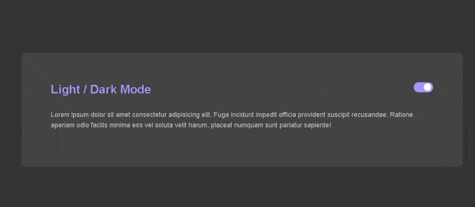

<h1 align="center">DarkMod With JavaScript</h1>
<h2 align="center">Transforming from light to dark theme using Javascript</h2>
 

    

<h2>🚀🚀 Tecnologias 🚀🚀</h2>

* ✅ HTML
* ✅ CSS
* ✅ SASS
* ✅ JavaScript

 
<h2> 💻📲 Como usar 💻📲 </h2>

* 📱💻 Baixe o Zip e execute o Index.html